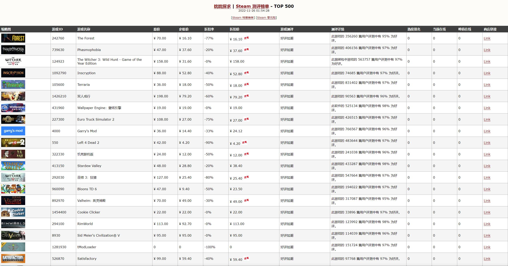

# steam-discount

> Steam 特惠游戏榜单 [ [Link](https://exp-tools.github.io/steam-discount/) ]

------

## 运行环境

 


## 项目介绍

从 Steam 商城爬取游戏的【打折（史低）】、【零元购】、【测评】、【热度】情况的榜单整理并展示。



> 随着脚本的运行次数越来越多，缓存到本地的数据库会越来越完善


## 官方接口文档

- https://steamcommunity.com/dev?l=schinese
- https://partner.steamgames.com/doc/webapi


## 开发者部署


本项目已配置 [Github Actions](https://docs.github.com/cn/actions/configuring-and-managing-workflows/configuring-a-workflow)，因此你只需轻松几步即可实现部署：

- [Fork 本项目](https://github.com/EXP-Tools/steam-discount/) 到你的代码仓库
- 通过 Settings --> Secrets 配置用于 发送 威胁情报邮件的 4 个环境变量：
    - `PAGES`： 爬取 steam 商城的游戏页数，建议 5
    - `ZONE`： 指定 steam 商城的地区，会影响售价单位，默认 CN （RMB）
    - `LIMIT`： 最终界面展示的游戏数量，建议 500
    - `FILTER`： 其他过滤参数，建议 globaltopsellers
- 启用 Settings --> Actions 功能

> 尔后程序便会每半时执行一次，并自动生成 [Github Page](https://lyy289065406.github.io/steam-discount/) 特惠排行榜单（若要调整执行频率，可修改 [`autorun.yml`](.github/workflows/autorun.yml) 的 `schedule` 触发时点）


## 目录说明

```
steam-discount
├── README.md ............................... [项目说明]
├── main.py ................................. [程序运行入口]
├── data
│   └── steam.db ............................ [sqlite: Steam 游戏库归档]
├── docs .................................... [Github Page 特惠排行一览]
├── src ..................................... [项目源码]
├── script .................................. [数据库脚本]
├── tpl ..................................... [模板文件]
└── log ..................................... [项目日志]
```
